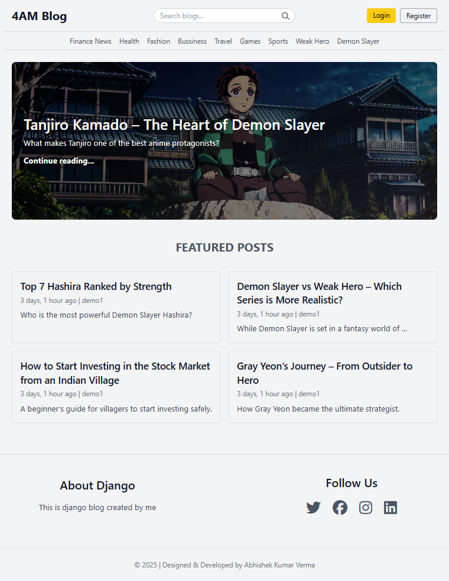
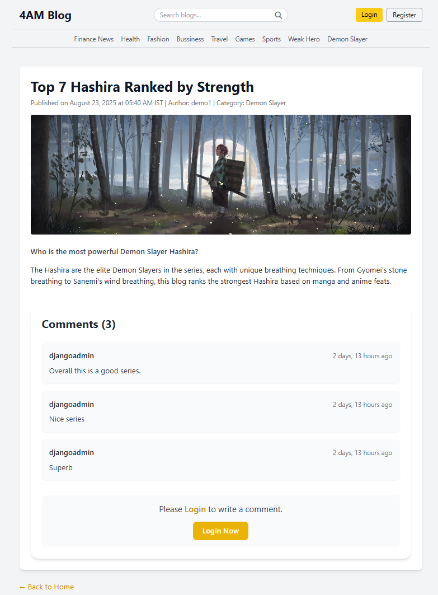
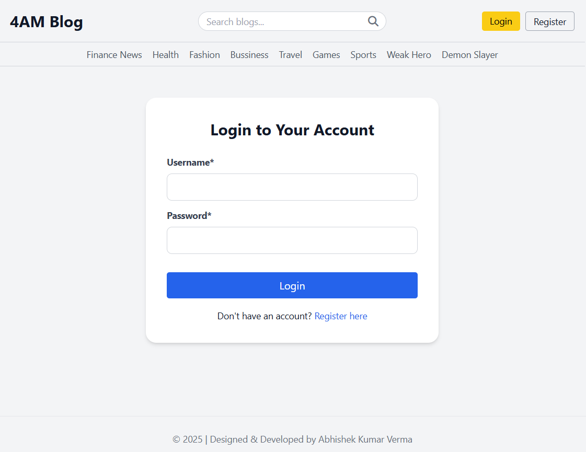
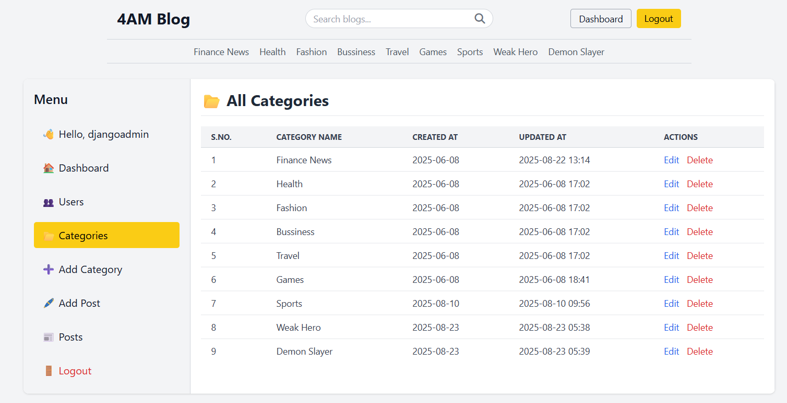

# 🕓 4AM Blog – A Django-Powered Blogging Platform

Welcome to the 4AM Blog — a clean, dynamic blogging web application built with Django. It supports category-based browsing, full-text search, user authentication, and a personalized dashboard for managing posts.

---

## 🔥 Features

* 🏠 Home page with latest blog highlights
* 🔎 Full-text blog search
* 🗂️ Category-based post filtering
* 📝 Individual blog view with slugs
* 🧑‍💻 User registration & login
* 🧾 User dashboard with post management
  * Add/Edit/Delete posts
  * Add/Edit/Delete categories
  * User management (Add/Edit/Delete users)
* 📅 Post scheduling support (future publish date)
* 🖼️ Media support for blog images (via Django's `MEDIA_URL`)
* 💻 Admin Panel for full control
* 🔒 Role-based access (regular user vs admin)
* 🧹 Simple template structure for easy customization
* ⚡ Responsive layout (mobile + desktop friendly)
* 🛠️ Search by category or keywords

---

## 🧪 Demo Credentials

**User Login:** 👤 ID: `demo` | 🔐 Password: `demo12345`  
**Admin Login:** 👑 ID: `djangoadmin` | 🔐 Password: `admin12345`  
URL: [http://127.0.0.1:8000/admin/](http://127.0.0.1:8000/admin/)

---

## 📸 Screenshots

### 🏠 Home Page


### 📝 Single Blog Post


### 🔐 Login


### 📋 Dashboard


### 🧑‍💻 User List / Edit User


### 🗂️ Category Management


---

## 🚀 Getting Started

### 1. Clone the repository

```bash
git clone https://github.com/yourusername/4am-blog.git
cd 4am-blog
````

### 2. Create and activate virtual environment

```bash
python -m venv env
env\Scripts\activate        # On Windows
# source env/bin/activate   # On macOS/Linux
```

### 3. Install dependencies

```bash
pip install -r requirements.txt
```

### 4. Start a new Django project (if creating from scratch)

```bash
django-admin startproject project_name
cd project_name
```

### 5. Start a new Django app (if needed)

```bash
python manage.py startapp app_name
```

### 6. Apply migrations

```bash
python manage.py makemigrations
python manage.py migrate
```

### 7. Create superuser (optional but recommended)

```bash
python manage.py createsuperuser
```

Follow the prompts to set a username, email, and password.

### 8. Run development server

```bash
python manage.py runserver
```

Visit: [http://127.0.0.1:8000/](http://127.0.0.1:8000/)

Press `Ctrl + C` in the terminal to stop the server.

---

## 🔗 URL Patterns

| Route                           | Description                                        |
| ------------------------------- | -------------------------------------------------- |
| `/`                             | Home page (latest blogs)                           |
| `/blogs/search/?q=`             | Search blogs by keywords                           |
| `/blogs/<slug>/`                | Individual blog detail                             |
| `/category/<id>/`               | Blogs by category                                  |
| `/register/`                    | User registration                                  |
| `/login/`                       | Login page                                         |
| `/logout/`                      | Logout                                             |
| `/dashboard/`                   | User dashboard (CRUD for posts, categories, users) |
| `/dashboard/posts/add/`         | Add new post                                       |
| `/dashboard/posts/edit/<id>/`   | Edit post                                          |
| `/dashboard/posts/delete/<id>/` | Delete post                                        |
| `/dashboard/categories/`        | Manage categories                                  |
| `/dashboard/users/`             | Manage users (Add/Edit/Delete)                     |
| `/admin/`                       | Django admin panel                                 |

---

## ⚙️ Deployment Notes

* Configure `DEBUG=False` in `settings.py` for production.
* Set proper `ALLOWED_HOSTS` for your domain.
* Use `whitenoise` or `nginx` for serving static files in production.
* Configure `MEDIA_ROOT` and `MEDIA_URL` properly for user-uploaded files.
* Consider deploying to **Render**, **Heroku**, or **DigitalOcean** for live hosting.

---

## 🧾 License

This project is licensed under the **MIT License** – feel free to use and modify.

---

## 👨‍💻 Author

**Abhishek Kr. Verma**
GitHub: [@abh0x1](https://github.com/abh0x1)

---

